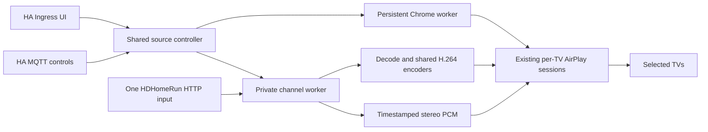

# Home Assistant deployment architecture — 0.2.3

Doubletake Browser has one shared source and independently controlled TV
connections. The source can be a saved browser page, YouTube video, Watch Later,
or an unprotected HDHomeRun channel. All selected TVs receive the same source.

## Channel flow

1. Choose **HDHomeRun channel** in the existing Source selector. Local discovery
   reads the tuner's current lineup; the address field is a discovery fallback.
2. Search by channel number/name, optionally save app-local favorites, and
   select a channel. Selection alone never starts a tuner or TV.
3. Check TVs and press **Play channel**. The UI applies exactly that receiver set.
   A per-TV MQTT launch instead adds its TV to the current shared source.
4. Stop one TV independently, or Stop all. The last receiver leaving closes the
   tuner input and worker. Startup, MQTT reconnect and app restart never play.

## Components

- The controller validates device identity and the lineup before resolving an
  internal channel URL. It does not accept arbitrary stream URLs, redirects,
  tuner locks, or authentication parameters. DeviceAuth is discarded.
- `channels.json` is a versioned private sidecar for device metadata, favorites
  and staged HA selections. Existing settings, IDs, browser profile, companion
  signing key and per-TV pairing files retain their formats and locations.
- The media worker runs as the existing unprivileged app user without
  Supervisor/MQTT credentials. One GStreamer pipeline demultiplexes the tuner
  connection, decodes/deinterlaces video and produces timestamped stereo PCM.
- H.264 video is shared by matching receiver canvases. Different canvases add
  encoding branches, not tuner connections. Private Unix sockets carry
  timestamped RFC4571 RTP into the existing Go AirPlay session implementation.
  Each receiver negotiates its own ALAC or AAC-ELD audio encoder.
- Both RTP tracks flatten segment origins to pipeline running time before
  ONVIF timestamp conversion. Broadcast and encoder stream-time offsets must
  not become extra wall-clock delay; the source A/V relationship is retained.
- The first channel backend uses software encoding because the image's VA
  encoder has unverified broadcast timestamp behavior. It targets 1080p30 or
  the existing 720p30 configuration. Browser GPU settings retain their behavior.
  Channel mode uses a 1500 ms automatic presentation lead; an explicit app
  latency setting still applies. These settings do not guarantee physical sync.
- A new channel warms before replacing the current source when a tuner is
  available. Only an explicit tuner-busy response permits releasing our own
  input for one retry. Reception/decoder failures preserve the current source.
  Stop invalidates an in-progress warmup. No automatic source reconnect occurs.
- Receiver queues are bounded and independent. A slow or failed receiver is
  disconnected instead of blocking its peers or being repeatedly reclaimed.
- The UI uses a compact status panel during channel playback. Interactive
  preview remains available for browser sources; channels do not open Chrome.
- Additive MQTT entities provide a staged Channel select, Play selected channel,
  and Source sensor. Existing page, YouTube, Stop and discovery IDs are retained.
  Retained commands are ignored.

## Release verification

Build the exact amd64 image on Linux with the pinned Go source archive and hash.
Require API/CSRF, persistence, source selection, Stop/cancellation, tuner error
classification and retained-command tests. The synthetic MPEG-TS fixture sends
known picture IDs and audio tones through real AirPlay protocol fixtures: two
matching ALAC receivers and a different-canvas AAC-ELD receiver must share one
input, sustain fresh frames, join/leave independently and release the tuner.

Run browser sandbox, private Xvnc, preview input, profile retention, YouTube,
native/diagnostic browser and responsive UI regressions in the same image.
Synthetic transport success is separate from real TV acceptance.

For each installation, verify a current native/off-server backup covering the
profile, pairing files and companion key before the supported Supervisor update.
Retain the old image/source and settings for rollback; do not uninstall or reset
data. Check HA health, Ingress boundaries and MQTT discovery after deployment.

A real-TV trial requires an available selected receiver set. Check visible
picture, audible sound, lip sync, tuning/switching, independent Stop, actual
tuner allocation and host load for 30 minutes. Record unverified items explicitly
and restore the previous source and TV set. Do not infer physical output from
sender counters or call a short decoder probe a sustained TV acceptance run.

## Boundaries

Only unprotected ATSC 1.0 MPEG-2/H.264 with supported MPEG/AC-3/AAC audio is
offered. Protected, ATSC 3.0/HEVC/AC-4 and unknown formats remain unavailable.
No arbitrary media URLs, independent per-TV programs, recording, timeshift,
live-TV pause, EPG, surround/caption guarantees or exact multiroom sync is added.
The app image currently supports amd64 HA hosts.
