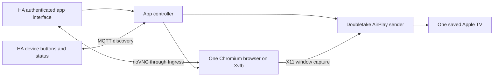

# Home Assistant deployment plan

The first release has one persistent browser and one active TV connection.
Saved TVs and named pages can be numerous; selecting another TV replaces the
existing receiver. Sending the same page to multiple TVs is a later extension.

## User flow

1. Open the app from Home Assistant's sidebar.
2. Add named pages and Apple TVs, or discover Apple TVs on the local network.
3. Select a page and choose **Open browser**. The live preview accepts mouse and
   keyboard input, including normal Home Assistant sign-in and navigation.
4. Choose a TV and **Show on TV**. This sends the same browser window that is
   visible in the preview. Enter any receiver pairing code in the app.
5. **Stop** ends AirPlay while retaining the browser. **Close browser** stops the
   browser too, after saving its profile.

## Components

- The app controller stores named pages, saved receivers, and stable IDs in
  its private `/data` volume. It starts a separate browser worker only on demand.
- The browser worker owns Chromium, Xvfb, loopback VNC, and the AirPlay sender.
  It has no Supervisor/MQTT credentials and receives commands over private pipes.
- The interactive preview uses noVNC, proxied over an authenticated Ingress
  WebSocket. VNC has a separate ephemeral password and listens only on loopback.
- Chromium retains its sandbox. Browser-close commands use a private control
  pipe so cookies and local storage are flushed before process cleanup.
- Pairing credentials are separate for each saved TV. The browser profile is
  shared across receiver choices, so switching TVs reuses the same website login.
- MQTT discovery exposes a device named **TV name Browser**, one **Show page**
  button per named page, **Stop**, **Status**, and **Page** sensors. Names can
  change without changing device/entity unique IDs. Commands are not retained.

## Deployment sequence

1. Run API, persistence, single-session, MQTT command/discovery, and access-control
   checks against temporary test state.
2. Build the actual amd64 app image on Linux. Exercise its sandboxed browser,
   noVNC authentication/input, video, charts, saved login storage, and AirPlay
   transport against a synthetic local receiver. Never upload real HA content.
3. Verify the HA host, configuration boundary, MQTT service, and backup. Install
   the reviewed app through Supervisor, with no Core/integration replacement.
4. Verify Ingress and MQTT device registration. Add the chosen local URLs and
   receiver in app data, not public source. Complete sign-in interactively.
5. Run the already requested Basement Apple TV trial; confirm the visible page,
   video and chart updates, stop behavior, and resource usage on the real host.
6. Record the app/source versions, backup, verification result, and remaining
   limitations in the HA operating procedure.

## Initial limits

- amd64 HA hosts, matching the intended server; other CPU architectures need
  a separately verified browser/codec image.
- Video only. Browser controls come from the web interface, not the Siri Remote.
- A sending state means the sender negotiated its session; TV display acceptance
  still needs physical observation.
- Restart and backup close the session. The web service returns without taking
  over a TV automatically. Browser authentication and receiver pairing persist.
- Multi-TV fan-out, automatic playback resumption, audio, and GPU acceleration
  follow only after the initial single-TV deployment is verified.

## Supported integration points

- [Home Assistant app configuration](https://developers.home-assistant.io/docs/apps/configuration/)
- [Ingress and its source-address boundary](https://developers.home-assistant.io/docs/apps/presentation/#ingress)
- [Supervisor service discovery](https://developers.home-assistant.io/docs/apps/communication/#services-api)
- [MQTT discovery](https://www.home-assistant.io/integrations/mqtt/#mqtt-discovery)
- [MQTT buttons](https://www.home-assistant.io/integrations/button.mqtt/)
- [noVNC API](https://novnc.com/noVNC/docs/API.html)
