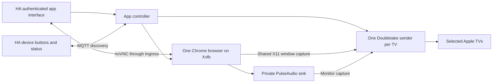

# Home Assistant deployment plan

Version 0.1.7 runs one persistent browser with a separate AirPlay sender for each
connected TV. All TVs share the same page, browser interactions, and audio. The
default output is 1920 × 1080 at 30 fps, with browser audio enabled.

## User flow

1. Open the app from Home Assistant's sidebar.
2. Add named pages and Apple TVs, or discover Apple TVs on the local network.
3. Select a page and choose **Open browser**. The live preview accepts mouse and
   keyboard input, including normal Home Assistant sign-in and navigation.
4. Check one or more TVs and choose **Show on TVs**. This applies exactly the
   checked set and disconnects unchecked TVs. The initial selection reflects
   current connections; polling preserves unsubmitted checkbox changes.
5. Use each TV's named pairing dialog, video/audio status, and **Stop** control.
   **Stop all** retains the browser; **Close browser** also saves its profile and
   closes it. The preview supports masked password Paste and is silent.

## Components

- The app controller stores named pages, saved receivers, and stable IDs in
  its private `/data` volume. It starts a separate browser worker only on demand.
- The browser worker owns Chrome, Xvfb, loopback VNC, a private PulseAudio daemon,
  and independently managed AirPlay senders. Browser audio reaches every sender
  through the private sink monitor; no host microphone or audio device is needed.
  It has no Supervisor/MQTT credentials and receives commands over private pipes.
- The interactive preview uses noVNC, proxied over an authenticated Ingress
  WebSocket. VNC has a separate ephemeral password and listens only on loopback.
- Chrome retains its sandbox. Native desktop controls are the default, with no
  browser debugging channel. A private debugging pipe remains an optional
  diagnostic mode. Browser-close requests allow cookies and local storage to
  flush before process cleanup. GPU video decoding is enabled when a compatible
  render device is accessible; AirPlay H.264 encoding remains in software.
- Pairing credentials are separate for each saved TV. The browser profile is
  shared across receiver choices, so switching TVs reuses the same website login.
- MQTT discovery exposes a device named **TV name Browser**, one **Show page**
  button per named page, **Stop**, **Status**, and **Page** sensors. Names can
  change without changing device/entity unique IDs. A launch button adds its TV
  to the existing receiver set. Launching the already selected page preserves
  the current browser interaction; another page changes the shared browser for
  all TVs. Commands are not retained. Pairing and receiver failures remain
  scoped to their TV, and audio failures are visible even if video keeps sending.

## Deployment sequence

1. Run API, persistence, multi-receiver lifecycle, MQTT command/discovery, and access-control
   checks against temporary test state.
2. Build the actual amd64 app image on Linux. Exercise its sandboxed browser,
   noVNC authentication/input, video, charts, saved login storage, and AirPlay
   audio/video transport against synthetic local receivers, including stopping
   one receiver while another continues. Verify native and diagnostic modes and
   the responsive multi-TV UI. Never upload real HA content.
3. Verify the HA host, configuration boundary, MQTT service, and backup. Install
   the reviewed app through Supervisor, with no Core/integration replacement.
4. Verify Ingress and MQTT device registration. Add the chosen local URLs and
   receiver in app data, not public source. Complete sign-in interactively.
5. Run the authorized real-TV trial; confirm the visible page, audible playback,
   video/chart updates, independent stop behavior, and host resource usage.
6. Record the app/source versions, backup, verification result, and remaining
   limitations in the HA operating procedure.

## Initial limits

- amd64 HA hosts, matching the intended server; other CPU architectures need
  a separately verified browser/codec image.
- One shared page; independent per-TV pages are not supported. Browser controls
  come from the web interface, not the Siri Remote. Preview audio is not provided.
- A sending state means the sender negotiated its session; TV display acceptance
  still needs physical observation. Audio active means capture started, not that
  sound was confirmed on the TV. Frame rate is a configured target; rendering,
  encoding, network conditions, and receiver behavior affect actual playback.
- Receivers have independent connections and buffering. Exact synchronization
  between TVs or synchronized multiroom audio is not guaranteed. Each additional
  receiver adds encoding and network load.
- Restart and backup close the session. The web service returns without taking
  over a TV automatically. Browser authentication and receiver pairing persist.

## Supported integration points

- [Home Assistant app configuration](https://developers.home-assistant.io/docs/apps/configuration/)
- [Ingress and its source-address boundary](https://developers.home-assistant.io/docs/apps/presentation/#ingress)
- [Supervisor service discovery](https://developers.home-assistant.io/docs/apps/communication/#services-api)
- [MQTT discovery](https://www.home-assistant.io/integrations/mqtt/#mqtt-discovery)
- [MQTT buttons](https://www.home-assistant.io/integrations/button.mqtt/)
- [noVNC API](https://novnc.com/noVNC/docs/API.html)
